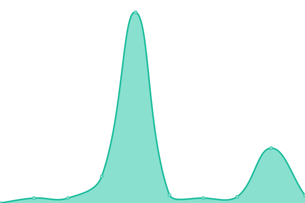
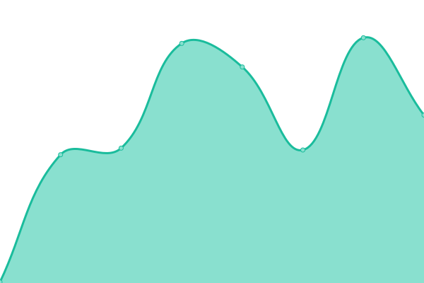

# [📈 Live Status](https://hyukishi.github.io/uptime): <!--live status--> **🟧 Partial outage**

This repository contains the open-source uptime monitor and status page for [jgrantham](https://hyukishi.github.io/uptime), powered by [Upptime](https://github.com/upptime/upptime).

With [Upptime](https://upptime.js.org), you can get your own unlimited and free uptime monitor and status page, powered entirely by a GitHub repository. We use [Issues](https://github.com/hyukishi/uptime/issues) as incident reports, [Actions](https://github.com/hyukishi/uptime/actions) as uptime monitors, and [Pages](https://hyukishi.github.io/uptime) for the status page.

<!--start: status pages-->
<!-- This summary is generated by Upptime (https://github.com/upptime/upptime) -->
<!-- Do not edit this manually, your changes will be overwritten -->
<!-- prettier-ignore -->
| URL | Status | History | Response Time | Uptime |
| --- | ------ | ------- | ------------- | ------ |
|  [JG Pihole Plex Server](https://plex.jgpihole.tk) | 🟥 Down | [jg-pihole-plex-server.yml](https://github.com/hyukishi/upptime/commits/HEAD/history/jg-pihole-plex-server.yml) | 

 634ms
     
 | 

<a href="https://hyukishi.github.io/upptime/history/jg-pihole-plex-server">100.00%</a>
    

|  [Home Assistant (JG Pihole)](https://jgpihole.duckdns.org) | 🟩 Up | [home-assistant-jg-pihole.yml](https://github.com/hyukishi/upptime/commits/HEAD/history/home-assistant-jg-pihole.yml) | 

 586ms
     
 | 

<a href="https://hyukishi.github.io/upptime/history/home-assistant-jg-pihole">100.00%</a>
    

|  [Bitwarden RS](https://bitwarden.jgpihole.tk) | 🟥 Down | [bitwarden-rs.yml](https://github.com/hyukishi/upptime/commits/HEAD/history/bitwarden-rs.yml) | 

 533ms
     
 | 

<a href="https://hyukishi.github.io/upptime/history/bitwarden-rs">100.00%</a>
    

|  [Jgrantham Resume](https://jgrantham.duckdns.org) | 🟩 Up | [jgrantham-resume.yml](https://github.com/hyukishi/upptime/commits/HEAD/history/jgrantham-resume.yml) | 

 199ms
     
 | 

<a href="https://hyukishi.github.io/upptime/history/jgrantham-resume">100.00%</a>
    

<!--end: status pages-->

[**Visit our status website →**](https://hyukishi.github.io/uptime)

## 📄 License

- Powered by: [Upptime](https://github.com/upptime/upptime)
- Code: [MIT](./LICENSE) © [jgrantham](https://hyukishi.github.io/uptime)
- Data in the `./history` directory: [Open Database License](https://opendatacommons.org/licenses/odbl/1-0/)
